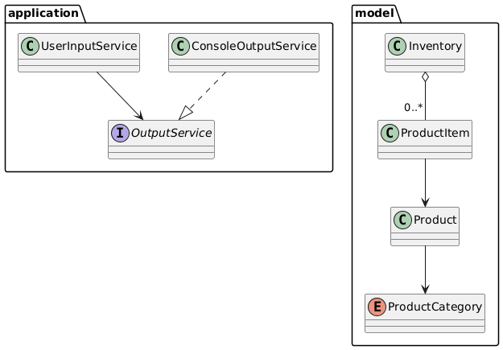

# java-crud-console

CRUD via console de um sistema de gerenciamento de items de produto em um inventário, armazenados em um arquivo .csv, aplicando conhecimentos em OOP Java.

## Visão Geral 

O projeto visa aplicar os conceitos de OOP, para desenvolver uma aplicação que permita o gerenciamento de items em um estoque, podendo ser aplicado em pequenas escalas visando automação das atividades corriqueiras em um estoque.

## Funcionalidades
- LISTAR
  * Ver as informações de todos os itens presentes no estoque
- CADASTRAR
  * Incluir um novo item ao estoque
- DELETAR
  * Apagar um item presente no estoque
- ADICIONAR
  * Incluir certa quantidade de um produto do estoque
- RETIRAR
  * Retirar certa quantidade de um produto do estoque
- SAIR
  * Sair da aplicação e encerrar o processo

## Tecnologias Utilizadas
- Java JDK 21
- Console

## Estrutura do Projeto
```text
java-crud-console/
  ├─ README.md
  ├─ src/
  |    ├─ application/
  |    |    ├─ main/
  |    |    ├─ ui/
  |    |    ├─ services/
  |    |    └─ enums/
  |    └─ model/
  |        ├─ entities/
  |        ├─ services/
  |        └─ enums/
  └─ assets/
      ├─ imagens/
      |     ├─ uml_dominio.png
      |     └─ uml_implementacao.png
      └─ UMLPlantText/
            ├─ uml_dominio.puml
            └─ uml_implementação.puml
```

### Diagrama de classes UML para domínio


Um diagrama de classes para implementação pode ser econtrado em assets\imagens\uml_implementacao.png
